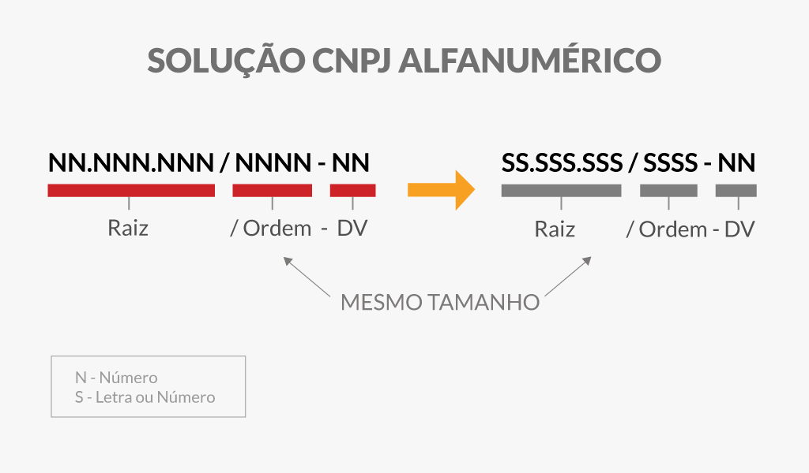

# Validador de CNPJ Alfanumérico
Validador de CNPJ Alfanumérico - Javascript

O CNPJ alfanumérico é a nova forma de identificar empresas no Brasil, combinando letras e números. A nova identificação da pessoa jurídica (PJ) será composta por números de 0 a 9 e quaisquer uma das 26 letras de A até Z.

<!--  -->

<!--  -->

<!--  -->

<!--  -->

<!--  -->

